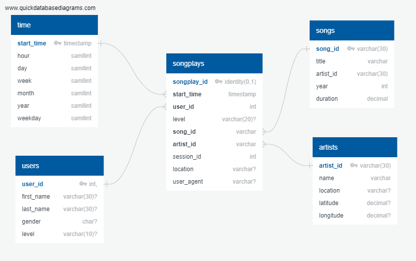

# Project: Data warehouse on AWS

The objectif of the project is to build a Data Warehouse for a public Song Dataset [link](http://millionsongdataset.com/):

The project start by constructing an ETL pipeline and load samples of the dataset, which are stored in S3, into staging tables within AWS Redshift, then extract and transform this data to fit our new schema.


The dataset is devided into three `S3 buckets`:
- `Song data`: s3://source_dir/song_data
- `Log data`: s3://source_dir/log_data
- `Meta data`: s3://source_dir/log_json_path.json, *meta information that is required to correctly load log_data*


In the first step of the project, two staging tables `staging_songs_table` and `staging_events_table` are created in Redshift to load raw data from json files located in our S3 buckets.

Before loading data, a redshift cluster is created and configured  in `dwh.cfg` file:

```ini
[CLUSTER]
HOST=
DB_NAME=
DB_USER=
DB_PASSWORD=
DB_PORT=
[IAM_ROLE]
ARN=
[S3]
LOG_DATA='s3://source_dir/log_data'
LOG_JSONPATH='s3://source_dir/log_json_path.json'
SONG_DATA='s3://source_dir/song_data'
```


## Database Schema Design:

The Following Schema is used to transform the data to a more logical and normal form, using `songplay` Fact table and 4 dimensional tables: `time`, `user`, `song`, `artist`: 





To enhance data loading efficiency, we implement a distribution strategy for the tables. This involves designating `song_id` as the distribution key and `user_id` as the sort key for the user table. We also apply the `auto` distribution style to the user table.


## Run the Pipeline:

Fact and dimentional tabels as well as staging tables are defined in `sql` module and created by excecuting the script:


> python create_table.py

    
To load and process data located into tables, we run the `etl.py`, The script uses:
- `COPY Command` to load data to staging tables
- `INSERT INTO` queries used to populate the Fact and dimension tables
    - Example:

```sql
COPY 'staging_events_table'
FROM 's3://source_dir/log_data'
CREDENTIALS 'aws_iam_role=<iam_role_arn>'
JSON 's3://source_dir/log_json_path.json'
TIMEFORMAT 'epochmillisecs' 
REGION 'us-west-2';
```

After running the etl.py script, data is extracted from S3 buckets and loaded into staging tables. Subsequently, the data is transferred to our dimension tables, adhering to the schema design.